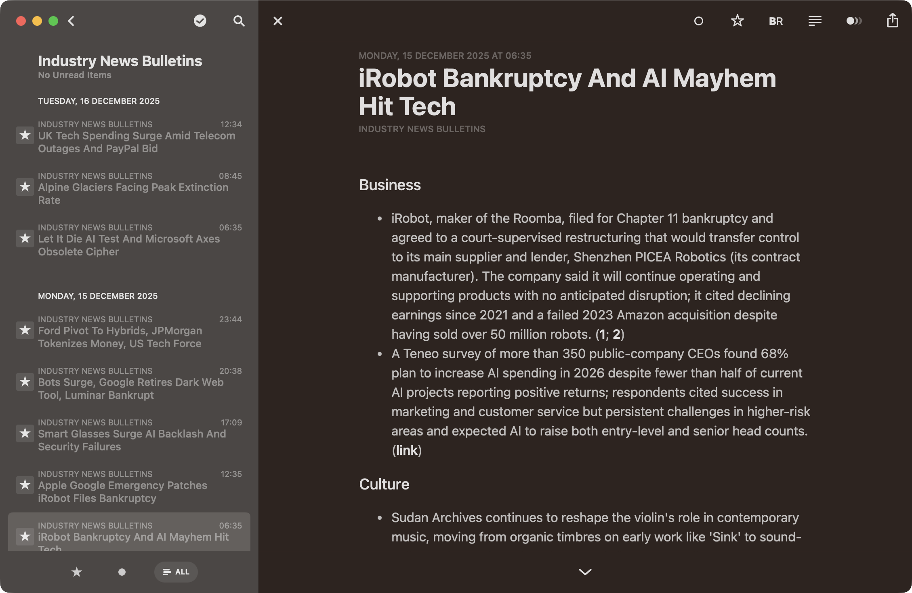

# Feed Summarizer

Funny story: This was mostly a vibe-coded project that got out of hand. It actually started as a Node-RED flow for personal use, then morphed into a Python script, and I thought it would both help me save time reading news in the mornings and make for a great demo of spec-driven development.

As a direct outcome of my swearing at various LLMs, it became this, which is, in a mouthful, an `asyncio`-based background service that fetches multiple RSS/Atom (and optional Mastodon) sources, stores raw items in SQLite, generates AI summaries (Azure OpenAI), groups them into bulletins, and publishes both HTML and RSS outputs (optionally uploading to Azure Blob Static Website hosting).

And the end-user experience, for me (using [Reeder Classic](https://reederapp.com/classic)), looks like this:



Neatly organized by topic, with concise summaries and links to the original articles, all in a clean, readable format I can peruse over breakfast.

## Overview

The pipeline is designed for efficiency (conditional fetching, batching, backoff) and the output is tailored to my reading habits (three "bulletins" per day that group items by topic, each bulletin published as both HTML and an RSS entry).

Most of the implementation started as a vibe-coded prototype, with some manual tweaking here and there, but it now has extensive error handling, logging, and observability hooks for Azure Application Insights via OpenTelemetry, and it publishes to Azure Blob Storage for publishing the results because there is no way I am letting this thing run a web server.

It is also deployable as a Docker Swarm service using [`kata`](https://github.com/rcarmo/kata), a private helper tool used for my own infrastructure.


## Quickstart (5 commands)

```bash
python -m venv .venv              # 1. Create virtualenv
source .venv/bin/activate         # 2. Activate it
pip install -r requirements.txt   # 3. Install dependencies
cp feeds.yaml.example feeds.yaml  # 4. Seed a starter config (edit it)
python main.py run                # 5. One full pipeline run (fetch→summarize→publish→upload*)
```

(\*) Azure upload happens only if storage env vars are set; otherwise it is skipped automatically.

## Features

- Concurrent conditional feed fetching (ETag / Last-Modified; respectful backoff & error tracking)
- Optional reader mode & GitHub README enrichment for richer summarization context
- AI summarization with per‑group introductions (opt‑in) via Azure OpenAI
- Topic/group bulletins rendered as responsive HTML + RSS 2.0 feeds
- SimHash-powered dedupe (optional BM25/FTS5 fallback) merges near-duplicate summaries and surfaces every source link
- Optional passthrough (raw) feeds with minimal processing
- Smart time‑based scheduling (timezone aware) plus interval overrides
- Azure Blob Storage upload with MD5 de‑dup (skip unchanged) & optional sync delete
- Graceful shutdown with executor timeouts and robust logging
- Config hot‑reload for feeds; caching of YAML & prompt data
- Observability hooks via OpenTelemetry (HTTP, DB, custom spans)

## Documentation

Long-form documentation is in the `docs/` folder:

- [CONFIGURATION](docs/CONFIGURATION.md) (env vars, secrets, scheduling)
- [RUNNING](docs/RUNNING.md) (CLI modes, flags, scheduling)
- [PUBLISHING](docs/PUBLISHING.md) (output paths, Azure upload)
- [TELEMETRY](docs/TELEMETRY.md) (OpenTelemetry + Azure exporter)
- [TROUBLESHOOTING](docs/TROUBLESHOOTING.md) (common symptoms and fixes)
- [ARCHITECTURE](docs/ARCHITECTURE.md) (module map and pipeline flow)
- [MERGE_TUNING](docs/MERGE_TUNING.md) (dedupe/merge behavior and diagnostics)
- [RETENTION](docs/RETENTION.md) (age window & retention controls)
- [SPEC](docs/SPEC.md) (long-form architecture/runtime spec)

---

## Contributions & License

See `LICENSE` (MIT) for licensing details. Contribution guidelines and a code of conduct will be documented in `CONTRIBUTING.md` and `CODE_OF_CONDUCT.md` as the project evolves. Security reports: (will be defined in `SECURITY.md`).

## Attribution

Some components and refactoring work were assisted by AI tooling; all code is reviewed for clarity and maintainability.
